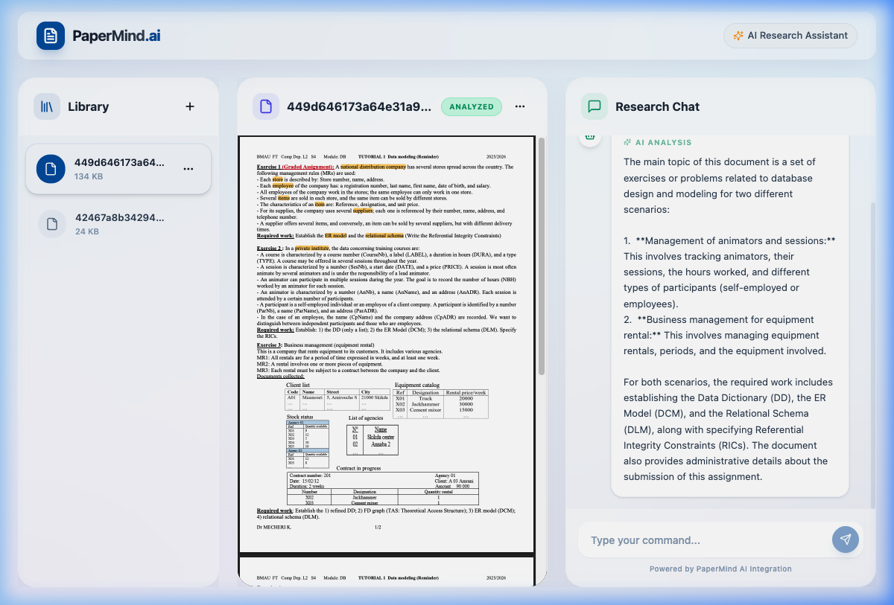

# PaperMind

Chat with your research papers. Upload a PDF, wait for it to index, then ask
questions and get answers streamed in from an LLM, each grounded in the
retrieved chunks of your document with the sources shown inline.

This is a portfolio project built to run locally. It is PDF-only by design:
the parser seam currently registers exactly one parser, for `.pdf`. There is
no hosted deployment and no multi-tenant story. What it does, it does on your
machine.

## Features

- PDF upload, parsing, chunking, and indexing into a vector store
- Streaming chat over the indexed document (SSE), with retrieved sources
  attached to each answer
- JWT auth with a demo mode for frictionless local use
- Retrieval evaluator with a committed ground-truth fixture
- Postgres for persistence, local filesystem for uploaded files

## Quick start

Free local path (no keys) — default:

```bash
export DEMO_MODE=true              # skip login, good for a first look
docker compose up --build          # uses Qdrant + BGE-M3 locally, no API keys
```

That boots Postgres + Qdrant, runs the migrations, and serves the API on
`http://127.0.0.1:3000` (`GET /health` to check). The frontend is a Vite app
and runs separately:

```bash
cd frontend
npm install
npm run dev
```

Then open the printed localhost URL. Environment variables for the frontend
are documented in [frontend/.env.example](frontend/.env.example), and the
backend's in [backend/.env.example](backend/.env.example).

Keys path — flip an env var and keep using paid providers:

```bash
export VECTOR_BACKEND=pinecone PINECONE_API_KEY=...
export EMBED_BACKEND=gemini GOOGLE_API_KEY=...   # or keep local embeddings
export MODE=google        # or groq with GROQ_API_KEY
docker compose up --build
```

## Free local vs keys

| Concern | Free local (default) | Keys (opt-in) |
|---|---|---|
| Vector store | `VECTOR_BACKEND=qdrant` on `http://localhost:6333` (compose `qdrant` service, volume `qdrant_storage`) | `VECTOR_BACKEND=pinecone` + `PINECONE_API_KEY`, collection `pdf-index` |
| Embeddings | `EMBED_BACKEND=local` — `BAAI/bge-m3` via `sentence-transformers`, CPU, 8192 ctx, 1024d Matryoshka, cached to `hf_cache` volume | `EMBED_BACKEND=gemini` — `gemini-embedding-001` (768d), needs `GOOGLE_API_KEY` |
| Retrieval | Hybrid dense + BM25 sparse fused with `RRF(k=60)`, `FETCH_K=50` → 5, gated reranker `RERANK=true` (22M MiniLM ~10ms/50 or `bge-reranker-v2-m3` ~80ms/50) | Same, with Pinecone `alpha` blend (`HYBRID_ALPHA`) |
| Chunking | `CHUNK_SIZE_TOKENS=512` / `CHUNK_OVERLAP_TOKENS=50` (~10%) via `tiktoken cl100k_base`, per-page, `page_no` + `content_hash` metadata | Same |
| Parser | `pymupdf` fast path default; `USE_DOCLING=auto` routes only image-only / borderless-table / 2-col PDFs to Docling (opt-in `.[docling]`), `USE_DOCLING=true` forces all | Same |
| Chat LLM | Still needs `MODE=google` (`GOOGLE_API_KEY`) or `MODE=groq` (`GROQ_API_KEY`) for answers | Same |
| Evaluator live | `uv run python -m evaluation.cli --live --no-judge` works with just local Qdrant (no Pinecone/Google) — see `backend/README.md` | `--live` with judge needs the chat key |

All free-path knobs live in `backend/.env.example` and `backend/compose.yaml`:
`VECTOR_BACKEND`, `EMBED_BACKEND`, `RERANK`/`RERANK_MODEL`, `CHUNK_SIZE_TOKENS`/`CHUNK_OVERLAP_TOKENS`,
`USE_DOCLING`, `LOCAL_EMBEDDING_MODEL`, `HYBRID_ALPHA`/`FETCH_K`.

If you'd rather run the backend without Docker, the manual path (uv, local
Postgres, Alembic) is in [backend/README.md](backend/README.md).

## Screenshots



## How it works

1. A PDF is uploaded, parsed into text, and split into chunks owned by the
   parser seam (so the chunking policy can't drift per format).
2. Chunks are embedded and stored in Pinecone; document metadata lives in
   Postgres.
3. A question is embedded, the nearest chunks are retrieved, and the LLM's
   answer streams back over SSE as it is generated.
4. The finished answer is persisted to Postgres together with the sources
   that were used, so reloading a document restores the full conversation.

## Architecture

```
┌──────────────┐  Vite dev   ┌───────────────────────────────────────┐
│   Frontend   │────────────▶│              Backend (Flask)          │
└──────────────┘             │                                       │
                             │  auth ── JWT (bcrypt) or demo bypass  │
                             │  chat ── SSE stream, answers + sources│
                             │  eval ── retrieval/answer evaluator   │
                             │                                       │
                             │  parser seam (pymupdf fast / Docling) │
                             │  storage seam (LocalStorage impl)     │
                             └──────┬──────────────┬───────────┬─────┘
                                    │              │           │
                             ┌──────▼─────┐ ┌──────▼────┐ ┌────▼─────┐
                             │  Postgres  │ │ Qdrant    │ │ LLM API  │
                             │ (metadata, │ │ (default) │ │ (Google  │
                             │  messages) │ │ or Pinec. │ │ or Groq) │
                             └────────────┘ └───────────┘ └──────────┘
```

## Design decisions

**Portability seams.** Two boundaries exist so no single vendor is load-bearing.
The storage seam (`backend/storage.py`) abstracts where uploaded files live;
the app currently ships the `LocalStorage` implementation, and anything that
can save, open, and serve a file can be substituted without touching route
code. The parser seam (`backend/services/document_parser.py`) maps file
extensions to parsers; chunking is owned by the seam (token-based
`CHUNK_SIZE_TOKENS=512` / `CHUNK_OVERLAP_TOKENS=50` via `tiktoken
cl100k_base`) so swapping parsers cannot silently change chunk sizes.
Honest note: PDF has two branches behind the same seam — `pymupdf` fast path
default for born-digital single-column PDFs, and an opt-in Docling branch
(`USE_DOCLING=auto|true`, `.[docling]` extra, `granite-docling-258M` ~1.1GB)
that preserves tables as Markdown and reading order for two-column / scanned
/ borderless-table PDFs. The heuristic in `services/pdf_heuristics.py`
routes only those PDFs to Docling; everything else stays on `pymupdf`.

**Vendor-neutral auth.** Auth is plain JWT with bcrypt-hashed passwords,
implemented in `backend/services/auth_service.py`. `DEMO_MODE=true` disables
the checks entirely, which keeps the app usable for a demo or a code review
without handing out accounts. Token signing falls back to a per-process
random secret when `JWT_SECRET` is unset, which is fine for a laptop and
documented as not fine for anything shared.

**Streaming with persisted sources.** Answers stream token by token over SSE
rather than arriving as one block, because a retrieval answer can take long
enough to generate that blocking feels broken. Sources are attached when the
stream completes and stored alongside the answer, so the conversation survives
a reload. If the primary provider fails mid-stream, the backend does not
replay the partial answer through the fallback; it surfaces the failure
instead.

**Retrieval evaluation.** `backend/evaluation/` measures the retrieval
pipeline against a committed ground-truth fixture: ten questions over two
sample documents, scored with hit-rate and recall@k, plus an optional
LLM-as-judge faithfulness check on generated answers. The scoring logic runs
in tests against deterministic fakes; a live run against real providers is
opt-in because it costs API calls. This exists so changes to chunking or
retrieval can be judged with numbers instead of vibes.

## Testing

```bash
cd backend
uv run pytest
```

Tests run against fakes and in-memory sqlite; they never touch real Qdrant/Pinecone,
the LLM, or real Postgres (heavy models mocked or `pytest.importorskip`'d; `uv run pytest` stays headless).

The evaluator (`backend/evaluation/`) measures retrieval against
`fixture.json` with `hit@5`/`recall@5` (k=5) + per-question breakdown and
`ingest sec/PDF` (parse/embed/upsert wall time) via
`evaluation/evaluator.py`; live runs are opt-in (`--live`). See
[backend/README.md](backend/README.md) for free local live instructions
(`http://localhost:6333` without Pinecone/Google keys).

## Technologies

- Backend: Python, Flask, SQLAlchemy, Alembic
- Frontend: React, TypeScript, Vite, Tailwind CSS, Zustand, React Query
- Database: Postgres
- Vector store: Qdrant (default, local) or Pinecone (opt-in, `VECTOR_BACKEND`)
- Embeddings: BGE-M3 local (`EMBED_BACKEND=local`, default) or Gemini (`gemini-embedding-001`)
- LLM: Google Gemini or Groq (chosen with `MODE`)
- Chunking: `tiktoken` `cl100k_base`, `CHUNK_SIZE_TOKENS=512` / `CHUNK_OVERLAP_TOKENS=50`
- Retrieval: hybrid dense + BM25 (`rank-bm25`) with RRF, gated local cross-encoder reranker
