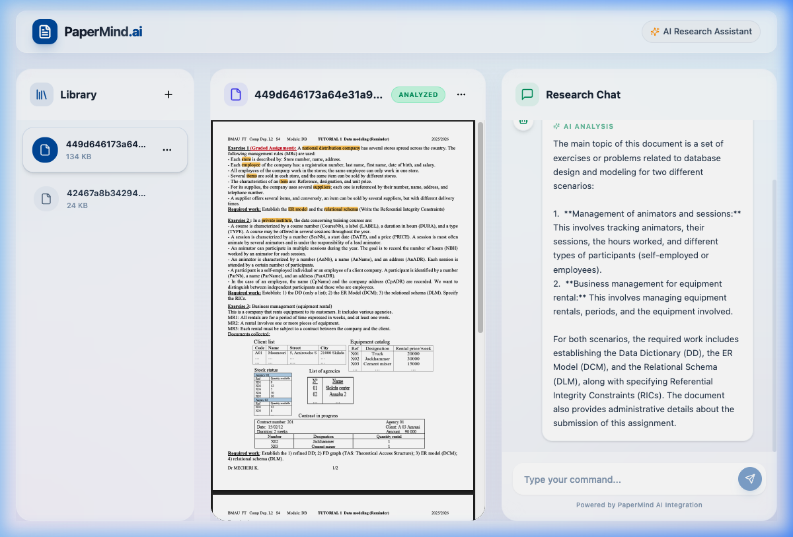

# PaperMind

Chat with your research papers. Upload a PDF, wait for it to index, then ask
questions and get answers streamed in from an LLM. Every claim in an answer
names the passages of your document that support it, and clicking a citation
opens the page it came from.

This is a portfolio project built to run locally. It is PDF-only by design:
the parser currently registers exactly one parser, for `.pdf`. There is
no hosted deployment and no multi-tenant story. What it does, it does on your
machine. The app runs as a single-instance workspace — no accounts, no login —
and stores one global set of provider settings.

## Features

- PDF upload, parsing, chunking, and indexing into a vector store
- Streaming chat over the indexed document (SSE), with retrieved sources
  attached to each answer
- Single-instance BYO provider: bring your own provider (Google or Groq),
  model, and API key via the Settings dialog — stored encrypted, never
  returned in plaintext
- Human titles derived from the PDF itself (metadata Title → original filename
  → first heading) while the stable uuid filename stays on disk and in Qdrant
- Evaluation that asks a committed labeled case set through the same answer
  path the chat route uses
- Postgres for persistence, local filesystem for uploaded files

## Quick start

```bash
# Generate local-only secrets once (random Postgres password, gitignored),
# then start infra (Postgres + Qdrant, loopback-only) — backend is not a compose service
backend/scripts/bootstrap-local.sh
docker compose -f backend/compose.yaml up -d
# Run backend locally
cd backend
uv sync
uv run alembic upgrade head
uv run python app.py   # API on http://127.0.0.1:3000 (GET /health)
```

The frontend is a Vite app and runs separately:

```bash
cd frontend
npm install
npm run dev
```

Then open the printed localhost URL. Environment variables for the frontend
are documented in [frontend/.env.example](frontend/.env.example), and the
backend's in [backend/.env.example](backend/.env.example).

Required env vars: `DATABASE_URL` (written by `backend/scripts/bootstrap-local.sh`
from a per-machine random password in gitignored `backend/.infra.env`)
and `QDRANT_URL` (defaults to `http://localhost:6333`). Optional: `QDRANT_API_KEY`
— empty for loopback development, required before any remote Qdrant address —
and `APP_SECRET`
— the Fernet root that encrypts the stored provider key. Set it in any
persistent deployment; changing it invalidates previously stored keys. With no
`APP_SECRET`, a warning is printed and stored keys cannot be encrypted or
decrypted. After boot, open Settings in the app and paste your provider key — no login step.

## Configuring a chat provider

There are no provider keys in the environment. Open the Settings dialog in the
app, pick a provider (Google or Groq) and a model from the curated list, paste
your own API key, and hit "Test connection" to verify before saving. Keys are
stored encrypted in the single `app_settings` row and applied to new chats
immediately. The app boots with no provider key present; asking a question
before saving settings returns a clear error pointing at Settings rather than
a crash or an env default.

Everything below runs free and local — no API keys anywhere in the pipeline
except the chat LLM, which is configured once in Settings:

| Concern | Detail |
|---|---|
| Vector store | Qdrant on `http://localhost:6333` (compose `qdrant` service, volume `qdrant_storage`), collection `pdf-index` |
| Embeddings | `BAAI/bge-m3` via `sentence-transformers`, CPU, 8192 ctx, 1024d Matryoshka, cached locally via `HF_HOME` (`~/.cache/huggingface`) — no API key |
| Retrieval | Hybrid 1,024-d dense + hashed term-frequency sparse with Qdrant IDF, fused by one Qdrant query using `RRF(k=60)`, 50 candidates → 5, gated reranker `RERANK=true` (22M MiniLM ~10ms/50 or `bge-reranker-v2-m3` ~80ms/50) |
| Chunking | `CHUNK_SIZE_TOKENS=512` / `CHUNK_OVERLAP_TOKENS=50` (~10%) via `tiktoken cl100k_base`, per-page, `page_no` + `content_hash` metadata |
| Follow-up context | The last `CHAT_RECENT_TURNS=4` answered turns, with the transcript capped at `CHAT_PRIOR_TURNS_TOKEN_BUDGET=1200` tokens and the evidence at `CHAT_CONTEXT_TOKEN_BUDGET=6000`. Oldest turns and lowest-ranked Citation Sources drop first, both counts are reported in the `retrieval` trace, and the current question is never truncated |
| Query expansion | A follow-up ("the second method") is searched with recent user questions prepended. `CHAT_QUERY_REWRITE=false` (default) costs no extra model call; `true` rewrites with the model and falls back to the deterministic expansion on failure. Both query forms land in the `done` event's `retrieval` block and in evaluation detail |
| Parser | `pymupdf` fast path default; `USE_DOCLING=auto` routes only image-only / borderless-table / 2-col PDFs to Docling (opt-in `.[docling]`), `USE_DOCLING=true` forces all |
| Chat LLM | Single-instance Settings: provider (Google or Groq), curated model, your own API key — encrypted at rest via `APP_SECRET` |
| Document title | Derived from PDF metadata Title → original filename (without extension) → first heading; stored alongside the uuid `filename` |
| Evaluator live | `uv run python -m evaluation.cli --live --no-judge` works with just local Qdrant; keys come from `PAPERMIND_EVAL_GENERATOR_API_KEY` and `PAPERMIND_EVAL_JUDGE_API_KEY`, never from a command-line argument. The generator and the judge are configured separately, and the judge's rubric version is recorded with the run. `--no-calibration` skips grading the hand-labelled set |

All free-path knobs live in `backend/.env.example`:
`RERANK`/`RERANK_MODEL`/`RERANK_REVISION`, `CHUNK_SIZE_TOKENS`/`CHUNK_OVERLAP_TOKENS`,
`CHAT_RECENT_TURNS`/`CHAT_PRIOR_TURNS_TOKEN_BUDGET`/`CHAT_CONTEXT_TOKEN_BUDGET`/
`CHAT_MAX_EXPANSION_CHARS`/`CHAT_QUERY_REWRITE`,
`USE_DOCLING`, `LOCAL_EMBEDDING_MODEL`/`LOCAL_EMBEDDING_REVISION`. Changing any
of those marks already indexed documents stale and asks for a reindex. The
`CHAT_*` knobs shape a request, not an index, so they take effect immediately.

The infra compose file is `backend/compose.yaml` (Postgres + Qdrant only,
both bound to `127.0.0.1` with credentials outside source control — see
[backend/README.md](backend/README.md) for the threat model and the steps
required before any remote exposure).
Manual backend run (uv, local Postgres, Alembic) is in [backend/README.md](backend/README.md).

## Screenshots



## How it works

1. A PDF is uploaded, parsed into text, and split into chunks by the parser
   (so the chunking policy can't drift per format).
2. Chunks are embedded and stored in Qdrant; document metadata lives in
   Postgres.
3. A question is embedded, the nearest chunks are retrieved, and the LLM's
   answer streams back over SSE as it is generated.
4. The finished answer is persisted to Postgres together with the sources
   that were used, so reloading a document restores the full conversation.

Every indexed document records the manifest its vectors were built with:
parser, chunk size and overlap, embedding model and revision, vector
dimension, sparse method and tokenizer, reranker model and revision, and the
collection schema version. When the running configuration no longer matches
that manifest the document is marked stale — its vectors are kept, the
library and chat panes show which setting changed, chat refuses with a
reindex action, and a reindex queues an ordinary ingestion job that only
replaces the active index generation once the replacement validates.
Documents indexed before manifests existed are marked stale once, so their
provenance gets recorded.

## Architecture

```
┌──────────────┐  Vite dev   ┌───────────────────────────────────────┐
│   Frontend   │────────────▶│              Backend (Flask)          │
└──────────────┘             │                                       │
                             │  settings ── single global app_settings│
                             │  chat ── SSE stream, answers + sources│
                             │  eval ── labeled cases, same path     │
                             │                                       │
                              │  parser (pymupdf fast / Docling)      │
                              │  storage (LocalStorage impl)          │
                             └──────┬──────────────┬───────────┬─────┘
                                    │              │           │
                             ┌──────▼─────┐ ┌──────▼────┐ ┌────▼─────┐
                             │  Postgres  │ │ Qdrant    │ │ Chat LLM │
                             │ (metadata, │ │ (vectors, │ │ (Google  │
                             │  messages, │ │  only)    │ │ or Groq, │
                             │  app       │ │           │ │  single  │
                             │  settings) │ │           │ │  key)    │
                             └────────────┘ └───────────┘ └──────────┘
```

## Design decisions

**Portable boundaries.** Two modules isolate vendor code so no single vendor is load-bearing.
The storage module (`backend/storage.py`) abstracts where uploaded files live;
the app currently ships the `LocalStorage` implementation, and anything that
can save, open, and serve a file can be substituted without touching route
code. The document parser (`backend/services/parsing/document_parser.py`) maps file
extensions to parsers; chunking is owned by the parser (token-based
`CHUNK_SIZE_TOKENS=512` / `CHUNK_OVERLAP_TOKENS=50` via `tiktoken
cl100k_base`) so swapping parsers cannot silently change chunk sizes.
Honest note: PDF has two branches behind the same parser — `pymupdf` fast path
default for born-digital single-column PDFs, and an opt-in Docling branch
(`USE_DOCLING=auto|true`, `.[docling]` extra, `granite-docling-258M` ~1.1GB)
that preserves tables as Markdown and reading order for two-column / scanned
/ borderless-table PDFs. The heuristic in `backend/services/parsing/pdf_heuristics.py`
routes only those PDFs to Docling; everything else stays on `pymupdf`.

**Single-instance, no auth.** The app has no users, no JWT, and no login
screen — every endpoint is open. A single `app_settings` row (provider, model,
`encrypted_api_key`) holds the BYO key, encrypted with Fernet derived from
`APP_SECRET` (see [docs/adr/0005-single-instance-no-auth.md](docs/adr/0005-single-instance-no-auth.md)).
`APP_SECRET` is optional locally but should be set in any persistent
deployment; changing it invalidates previously stored keys.

**Document title from context.** Storage keeps the uuid hex `filename` for
stable Qdrant and filesystem paths; the display `title` is derived from the
file's own context (PDF metadata Title → original filename → first heading)
and surfaced in the library, reader toolbar, and metadata (see
[docs/adr/0006-document-title-derived-from-context.md](docs/adr/0006-document-title-derived-from-context.md)).

**Streaming with persisted sources.** Answers stream token by token over SSE
rather than arriving as one block, because a retrieval answer can take long
enough to generate that blocking feels broken. Sources are attached when the
stream completes and stored alongside the answer, so the conversation survives
a reload. If the chosen provider fails mid-stream, the backend does not
silently answer through a different one; it surfaces the failure so the user
can fix their own key or quota. That no-fallback rule is deliberate — with
a single BYO key, a silent switch would hide the billing owner's error
(see [docs/adr/0001-per-user-byo-provider-keys.md](docs/adr/0001-per-user-byo-provider-keys.md)).

**One terminal event per answer.** The stream opens with `start` (the recorded
Turn), carries `token` events, and ends with exactly one of `done`,
`abstained`, `provider_error`, `citation_error`, `persistence_error`, or
`cancelled`. `done` is sent only after the Turn and its Citation Sources are
committed, so a stored answer on screen is an answer in history. The browser
rejects an event the protocol does not define, and treats a stream that ends
without a terminal event as a failure — an indefinite loader would be
indistinguishable from a slow answer. Each way an answer can end reads
differently: a timeout, an empty answer, a provider failure, an unresolvable
citation, a save failure, and a stop are six separate messages, not one generic
error.

**Citations that name something real.** Every retrieved Passage gets a stable
id (`S1`, `S2`, …) and its retrieval rank before the model is called, and the
model is asked to list the ids behind each claim it makes. A `done` event
carries those claims, whether the answer is grounded in them, and the
`prompt_version` the answer was produced under; the claims and ids are stored
with the answer, so a reloaded transcript cites the same passages in the same
order. An id that was never supplied is not a citation to a thin claim — the
app asks the model to correct the mapping once, and if it still names a
passage that does not exist, the turn ends as `citation_error` rather than
showing a citation the reader cannot open. Retrieval scores stay internal:
the interface shows rank and retrieval method, never a score dressed up as a
confidence percentage.

**Abstaining before it costs anything.** When retrieval leaves nothing usable
— no passage for the question at all, or matches that cannot be read or cited —
the app says so itself and never calls the provider. The exchange is stored as
a completed Turn carrying a machine-readable reason, with no Citation Sources
invented for it, and the reason travels into history so a reload still shows an
abstention rather than a blank answer. An unreachable vector store is not an
abstention: that stays an error the user can retry, so an outage is never
replayed as a considered refusal.

**Bounded by the model's own budget.** Every catalogued model declares an
input budget, an answer budget, a generation timeout, and the finish reasons
its API reports. The prompt is trimmed to fit the input budget, the answer
budget is sent to the provider on every call, and a stream that stalls is
abandoned at the timeout rather than left running. An answer is only called
complete when the provider said so; anything else is flagged as truncated
rather than presented as a finished thought. A transient provider failure is
retried once on the same provider, and only before the first fragment reaches
the user — retrying later would either duplicate text on screen or bill the
same account twice for a partial answer.

**Single-instance BYO keys.** Provider, model, and API key are global app
settings configured in the Settings dialog, not server environment variables.
Keys are encrypted at rest with Fernet and only ever returned masked. The app
boots with no provider key present; a workspace with no saved settings gets
a clear error pointing at Settings rather than a crash or an env default.

**Evaluation runs the app.** `backend/evaluation/` asks a committed labeled
case set (57 questions over four sample documents) the way a reader asks them.
The fixture documents are stored and indexed by the same ingestion job and
worker the upload route uses, and every question goes through the same answer
path the chat route uses: same document context, retrieval, bounded prompt,
citation validation, abstention, and persistence. There is no second retrieval
or generation path to drift out of sync.

Each case ends as whatever it actually was — an answer, an abstention, a
provider failure, an unusable citation, a failed save, or a refusal — and only
an answer the model wrote is handed to a grader. Retrieved text quoted back
after a provider failure is a fallback, not an answer, so scoring it would
credit the model with the retrieval. Graders say Unknown when they have nothing
to decide, and a failure is scored as a failure rather than as a quiet zero. A
run records the index manifest and
generation, the retrieval method, the prompt version, the provider, the model,
and the settings behind every number, and the retrieval contract is checked
once up front: a store that cannot serve hybrid fails the run rather than
quietly reporting dense numbers.

The tests run the whole thing offline against deterministic embedding, vector
store, and provider doubles. A live run needs local Qdrant and a provider key
read from `PAPERMIND_EVAL_GENERATOR_API_KEY` (and
`PAPERMIND_EVAL_JUDGE_API_KEY` for the judge), never from a command-line
argument. Generator and judge are configured separately, so a run can generate
with one account and grade with another.

## Testing

Run the fast suite against fakes and in-memory SQLite:

```bash
cd backend
uv run pytest
```

Run the full HTTP workflow against disposable Postgres and Qdrant services:

```bash
cd backend
./run-full-stack-tests.sh
```

The full-stack run applies every migration to an empty database, uses deterministic local embedding, reranking, and chat providers, and removes its database, collection, and containers when it finishes. It needs Docker but no model API keys or paid services.

The evaluator (`backend/evaluation/`) runs a versioned labeled case set
(`backend/evaluation/datasets/`) through the production answer path and
reports three things together. Retrieval is scored per question and in
aggregate with hit rate, recall, MRR, and nDCG, where the
ideal ranking is one relevant chunk per gold snippet, so a run that found only
some of the evidence cannot read as a perfect one. Answers are graded twice
over: six deterministic graders decide the case outcome, the abstention
decision, whether the citations reach the evidence, whether the claims are
readable, whether every claim names a supplied Passage, and whether every page
the answer points at is a page that claim cited, while a separately configured
judge grades faithfulness against the context and correctness against the
expected answer against a versioned rubric. Every metric reports what it could
not decide as Unknown rather than as a zero, and a provider failure fails the
case instead of improving a score. Latency is reported at p50 and p95 for
retrieval, time to first token, and total, with the run's first measured case
held apart from the rest so a cold start is not reported as steady state, next
to input and output tokens, finish reasons, and a cost estimated from the
catalog's prices. A judged run also grades a hand-labelled calibration set and
reports where the judge disagreed with the person.

The case set is 57 reviewed questions over four sample documents, split into a
tuning half and a reported half before any configuration was chosen, so the
numbers a report quotes were not the numbers that were fitted. Every document
is pinned by content hash, so a replaced file cannot keep answering to
expectations a person wrote against the old one, and a report names the version
of the set it measured. The handful of cases that only mean something with a
failure injected are held back from a run and named in the run record.

Live runs are opt-in (`--live`); `--split tuning` runs the other half, and
`--compare-rerank` runs the case set twice, once with the reranker gate off and
once with it on, and reports both. See [backend/README.md](backend/README.md) for free local live
instructions (`http://localhost:6333` with `--no-judge` needs no chat key).

**A published report backs the retrieval claims.**
[`backend/evaluation/reports/2026-09-retrieval-baseline-v1/`](backend/evaluation/reports/2026-09-retrieval-baseline-v1/)
is a checked-in run of the reported half of the case set against real
documents, real local embeddings, and real Qdrant, with
[`2026-09-retrieval-tuning-v1`](backend/evaluation/reports/2026-09-retrieval-tuning-v1/)
beside it covering the half the variants were chosen on. It compares the shipped
configuration with dense-only, sparse-only, hybrid-only, reranked, two
candidate depths, two query-expansion policies, and two chunking policies, all
chosen on the tuning half, and reports retrieval quality, retrieval latency, and
the per-question rows behind every difference. It is retrieval only: no model
was called, so the report carries no answer, citation, abstention, token, or
dollar figure, and says so. The manifest beside the numbers names the revision,
the case set, every document's hash and index manifest, the prompts, the
models, and the environment, and `--compare-report` says whether a re-run
reproduced it. A run with generation and judging writes a report of the same
shape with those sections filled in, and is what the answer-quality claims
should be quoted from.

## Technologies

- Backend: Python, Flask, SQLAlchemy, Alembic
- Frontend: React, TypeScript, Vite, Tailwind CSS, Zustand, React Query
- Database: Postgres
- Vector store: Qdrant (local, `http://localhost:6333`)
- Embeddings: BGE-M3 local via `sentence-transformers` (CPU, 1024d, no key)
- LLM: Google Gemini or Groq, single-instance via the Settings dialog (BYO key, encrypted at rest)
- Chunking: `tiktoken` `cl100k_base`, `CHUNK_SIZE_TOKENS=512` / `CHUNK_OVERLAP_TOKENS=50`
- Retrieval: named dense vectors plus hashed term-frequency sparse vectors with Qdrant IDF and RRF, gated local cross-encoder reranker
