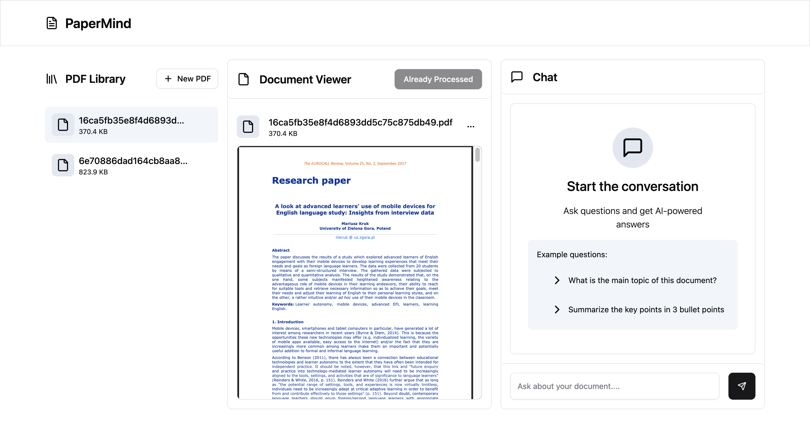

# PaperMind
An AI-powered chat application that leverages Retrieval-Augmented Generation (RAG) to enable intelligent, context-aware conversations about uploaded documents.

## Overview

This application combines the power of Large Language Models (LLMs) with document retrieval capabilities, allowing users to upload files and engage in meaningful conversations about their content. The RAG architecture ensures that responses are grounded in the actual document content, providing accurate and contextually relevant answers.

## Features

- **Document Upload**: Support for multiple file formats (PDF, TXT, DOCX, etc.)
- **Intelligent Retrieval**: Advanced vector search to find relevant document sections
- **Context-Aware Responses**: LLM responses based on retrieved document content
- **Interactive Chat Interface**: Seamless conversation experience
- **Real-time Processing**: Fast document indexing and query processing
- **Multi-document Support**: Handle multiple files simultaneously

## How It Works

1. **Document Ingestion**: Users upload files which are processed and chunked into manageable segments
2. **Vector Embedding**: Document chunks are converted into vector embeddings for semantic search
3. **Query Processing**: User questions are embedded and matched against document vectors
4. **Context Retrieval**: Most relevant document sections are retrieved based on similarity
5. **Response Generation**: LLM generates responses using the retrieved context and user query

## Screenshots

### Main Chat Interface

*Clean and intuitive chat interface for seamless document conversations*


## Architecture

```
┌─────────────────┐    ┌─────────────────┐    ┌─────────────────┐
│   Frontend UI   │────│   Backend API   │────│   Pinecone DB   │
└─────────────────┘    └─────────────────┘    └─────────────────┘
                              │
                       ┌─────────────────┐
                       │  Google Gemini  │
                       └─────────────────┘
```

## Technologies Used

- **Backend**: Python, Flask
- **Frontend**: React/
- **Vector Database**: Pinecone
- **LLM Integration**: Google Gemini API
- **Document Processing**: LangChain
- **Embeddings**: Google Gemini Embeddings
- **RAG Framework**: LangChain
